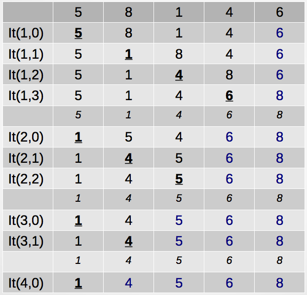
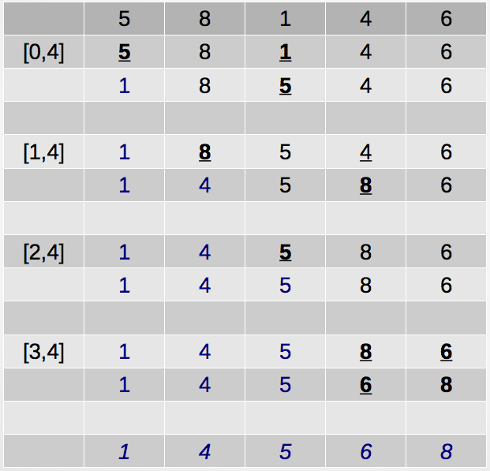
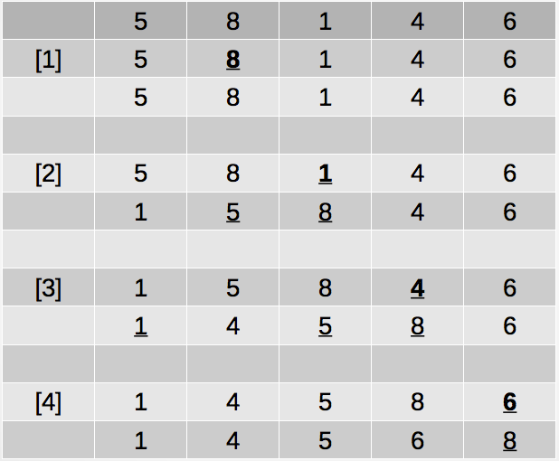
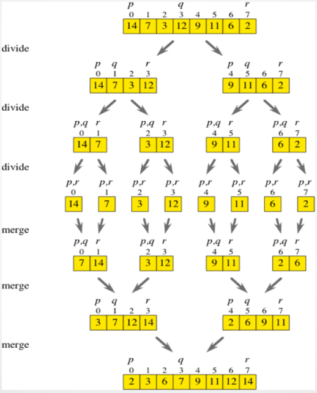

# Tema 10: Algoritmos de ordenación

## Contenidos

- [1. Algoritmos de ordenación](#1)
	- [1-1. Algoritmo de la burbuja ](#1-1)
	- [1-2. Algoritmo de selección ](#1-2)
	- [1-3. Algoritmo de inserción ](#1-3)
	- [1-4. Algoritmo *mergesort* ](#1-4)

## <a name="1"/> 1. Algoritmos de ordenación

Es interesante y habitual la operación de ordenación en un array. La búsqueda de un dato dentro de un conjunto es otro de los procesos más habituales en el tratamiento de información. Si los datos están ordenados, la localización de uno de ellos puede acelerarse.

Por ejemplo, si quereos mantener ordenado un vector de calificaciones para poder consultar rápidamente las cinco mejores notas, tendríamos que ordenar nuestro vector de mayor a menor (en orden decreciente) y acceder a las cinco primeras posiciones del vector.

Imaginemos que tenemos declarado el siguiente vector:

~~~c
int vec[5]={1, 5, 6, 4, 2};
~~~

Ahora queremos saber si un determinado valor, 3 por ejemplo, se encuentra en dicho vector, o queremos devolver el valor más parecido ¿qué haríamos?
Lo mismo podemos hacer para cadenas de caracteres (que es donde más se usa la ordenación).

Vamos a ver varios métodos (algoritmos) de ordenación de vectores.
Aunque los veamos para enteros, son perfectamente extensibles a otros tipos de datos (incluso registros).
Sólo tendríamos que definir la manera de comparar datos (<, >, =) Podemos ordenar de mayor a menor o de menor a mayor.

Cada algoritmo tiene su **complejidad**. Son métricas que permiten conocer el tiempo de procesamiento de cada algoritmo.
La forma estándar es utilizar ordenes de complejidad, que relacionan el tiempo de computación con el tamaño del problema a tratar.
La jerarquía de ordenes de complejidad sería O(1)<O(log n)<O(n)<O(n logn)<O(n2)<O(n3)<O(n4)..

### <a name="1.1"/> 1.1 Algoritmo de la burbuja

El método de la burbuja funciona revisando cada elemento del vector que va a ser ordenado con el siguiente, intercambiándolos de posición si están en el orden equivocado. Es necesario revisar varias veces todo el vector hasta que no se necesiten más intercambios, lo cual significa que está ordenado. Este algoritmo obtiene su nombre de la forma con la que suben por la lista los elementos durante los intercambios, como si fueran pequeñas burbujas. También es conocido como el método del intercambio directo.

Características:

- Más sencillo e intuitivo de aplicar
- En el peor de los casos tenemos una complejidad cuadrática (si tenemos n datos, O(n2))
- Se empieza por el primer elemento de la lista y se recorre toda la lista.
- Dado un elemento, este se compara con el siguiente y si no está en el orden adecuado (por ejemplo, es mayor) se intercambia.
- Hay que recorrer n-1 veces la lista. Si es la iteración k, el punto anterior lo hacemos hasta n-k

~~~c
desde i = 1 hasta n hacer
   desde j = 0 hasta n-i hacer
      si elemento[j] > elemento[j+1] entonces
         // Intercambiar los elementos
         aux = V[j]
         V[j] = V[j+1]
         V[j+1] = aux
      fin_si
   fin_desde
fin_desde
~~~

Implementación:

~~~c
int temp, i, j;

for (i = 1; i < elems; i++) {
   for (j = 0; j < elems-i ; j++) {
      if (v[j] > v[j+1]) {
         temp = v[j];
         v[j] = v[j+1];
         v[j+1] = temp;
      }
   }         
}
~~~

### <a name="1.2"/> 1.2 Algoritmo de selección

Consiste en encontrar el menor de todos los elementos del vector e intercambiarlo con el que está en la primera posición. Luego el segundo mas pequeño, y así sucesivamente hasta ordenarlo todo. Su implementación requiere O(n2) comparaciones e intercambios para ordenar una secuencia de elementos.

- Mejora algo el anterior, aunque todavía tiene una complejidad O(n2)
- Realizamos n iteraciones
- Para cada iteración, buscamos el elemento con menor (mayor) valor del vector.
- Intercambiamos ese valor por la posición actual del vector
- En la primera iteración, buscamos el menor valor de todo el vector
- En la segunda, el segundo menor valor o el menor valor del resto del vector

Pseudocódigo:

~~~c
para i=1 hasta n-1;

   minimo = i;
   para j=i+1 hasta n
       si lista[j] < lista[minimo] entonces
           minimo = j
       fin si
   fin para
   intercambiar(lista[i], lista[minimo])
fin para
~~~

Implementación:

~~~c
  int minimo=0,i,j;
  int swap;
  for(i=0 ; i<n-1 ; i++)
  {
     minimo=i;
     for(j=i+1 ; j<n ; j++)
        if (x[minimo] > x[j])
           minimo=j;
     swap=x[minimo];
     x[minimo]=x[i];
     x[i]=swap;
  }
~~~

### <a name="1.3"/> 1.3  Algoritmo de inserción

Este método consiste en insertar un elemento del vector en la parte izquierda del mismo que ya se encuentra ordenada. Este proceso se repite desde el segundo hasta el n-esimo elemento.

- Seguimos teniendo una complejidad O(n2)
- Es lo más parecido a ordenar un mazo de cartas
- El primer elemento de la lista lo consideramos ordenado
- Para el resto, vamos analizando uno a uno cada valor
- Cogemos el valor y lo insertamos en la posición correcta del vector que nos queda a la izquierda de dicho valor, desplazando los valores hacia la derecha

Implementación:

~~~c
void Insercion(int numbers[], int array_size) {
  int i, a, index;
  for (i=1; i < array_size; i++) {
    index = numbers[i];
    a = i-1;
    while (a >= 0 && numbers[a] > index) {
      numbers[a + 1] = numbers[a];
      a--;
    }
    numbers[a+1] = index;
  }
}
~~~

### <a name="1.4"/> 1.4  Algoritmo *mergesort*

Es un método basado en la técnica "divide y vencerás". Consiste en dividir el problema a resolver en subproblemas del mismo tipo que a su vez se dividirán, mientras no sean suficientemente pequeños.

- Aquí vamos a reducir la complejidad a O(nlogn)
- Es un ordenamiento por mezcla
- Si el vector tiene uno o cero elementos, lo consideramos ordenada
- Si no, dividir el vector por la mitad y aplicar la ordenación a cada parte de manera **recursiva**.
- Mezclar los dos vectores obtenidos en uno ya ordenado y devolverlo como resultado

~~~c
void mergesort(int a[],int i,int j)
{
    int mid;

    if(i<j)  // caso base
    {
        mid=(i+j)/2;
        mergesort(a,i,mid);        //left recursion
        mergesort(a,mid+1,j);    //right recursion
        merge(a,i,mid,mid+1,j);    //merging of two sorted sub-arrays
    }
}
~~~

- La función `merge`se deja como ejercicio.

## Ejercicio

Utilizando los cuatro métodos de ordenación vistos anteriormente, ordena los arrays de registros de alumnos (por apellido) y vehículos (por matrícula) de los ejercicios del tema 7.

----

Programación 1, Grado de Robótica, curso 2017-18  
© Departamento Ciencia de la Computación e Inteligencia Artificial, Universidad de Alicante  
Cristina Pomares Puig
